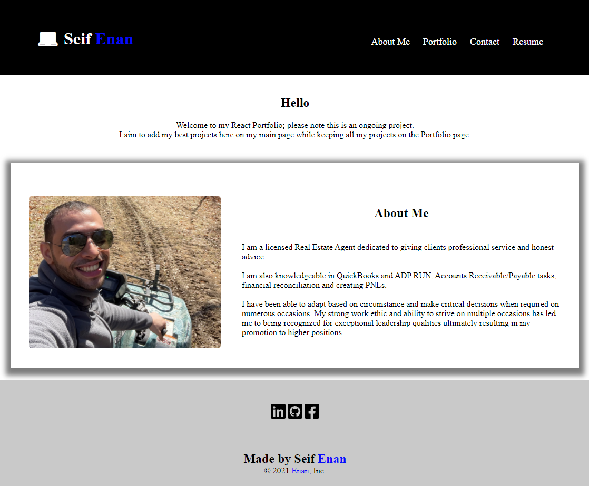

  # c20-react-portfolio  
  

  ## Description  
  This portfolio was created using React.

  [Deployed Link](https://seifenan.github.io/c20-react-portfolio/)

  ## Table of Contents 
  * [description](#description)
  * [usage](#usage)
  * [questions](#questions)
  * [license](#license)
  

  ## Usage 
  Thank you for visiting my repo!

  
  
  ## Questions
  To check out more of my projects, visit my [GitHub](https://github.com/seifenan) page.
  To reach me with more questions email me at seifenan@gmail.com. 

  ## License
  
